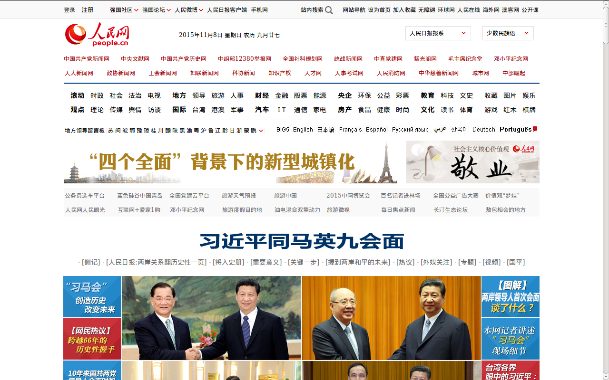

# Web版 My Diary

- [需求](#需求)
- [背景知识](#背景知识)
	- [Server/Client](#serverclient)
	- [HTTP](#http)
- [Comments](#comment)

## 需求
- 每次运行时合理打印出过往的所有笔记
- 一次接收输入一行笔记
- 在服务端保存为文件

## 背景知识

### Server/Client
- 如何理解`浏览网页`这一行为
 
  比如，我们打算在人民网上看看今天的新闻，我们可能会：
  1. 在浏览器中输入人民日报的网址`http://www.people.com.cn`
  2. 等待一些时候，浏览器就开始显示各种内容，包括人民网的Logo，头条新闻`习近平同马英九会面`，并且还有他们握手的照片等等。
  
  3. 之后，我们觉得ok，打算看看这条新闻在说什么，我们就点击`习近平同马英九会面`，于是弹出了另一个页面，包含着这条新闻的具体内容，更多的照片和文字。

如果我们看向这些操作的背后，其实实际发生的过程可能是这样的：

> 在浏览器中输入人民日报的网址`http://www.people.com.cn`

- 我们的浏览器是一个`Client`，就好比我们如果去买一份人民日报的报纸的话，我们就是他们的顾客一样，Client意味着我们是那个要获取信息的一方。
- 而在遥远的某个地方，存在这一个叫Server的机器，它就像是人民日报出版社，就像它的名字一样，它是提供服务的一方。
- **浏览网页其实就是我们的浏览器作为一个Client，向服务器发送请求，而服务器根据我们的请求，将我们要求的信息，也就是网页，返回给我们的过程**
- 这个过程更像是我们通过邮局订阅杂志，我们输入的网址`http://www.people.com.cn`，当中的`www.people.com.cn`，就是我们要邮寄订阅单的地址，而它之前的`http`则是说我们打算用哪一家邮政公司来沟通。

>  等待一些时候，浏览器就开始显示各种内容，包括人民网的Logo，头条新闻`习近平同马英九会面`，并且还有他们握手的照片等等。

- 刚才我们输入了网址，也就是给人民日报的服务器通过`http`这个邮政公司（暂且理解为邮政公司，后面再具体解释）发送了订阅单，即发送了一个请求，而人民日报的服务器在收到这个请求之后，随即将我们请求的内容，也就是今天各大新闻的文字、图片等等组织好发送了回来。
- 网页其实是一个文档（`.html`文档，后面详述），也就是说，我们向服务器发送的请求其实是说：`服务器，请把你的首页的这一个网页文档发送给我`

> 之后，我们觉得ok，打算看看这条新闻在说什么，我们就点击`习近平同马英九会面`，于是弹出了另一个页面，包含着这条新闻的具体内容，更多的照片和文字。

- ok, 我们点击到了一个标题上面，它弹出了另一个窗口，我们可以看到地址栏里已经不是原来的`http://www.people.com.cn`，而变成了`http://politics.people.com.cn/n/2015/1108/c1024-27789606.html`，也就是说，刚才点击的标题，是向服务器发送了另一个请求信息，即`服务器，请把这一条新闻的网页文档发送给我`
- 地址栏中的`/n/2015/1108/c1024-27789606.html`部分，就是我们所请求的网页文档的名字

Ok， 总结一下
- 浏览网页是一个Server和Client双方参与的过程
- Client向Server提出请求，Server向Client发送信息（以文档的形式）
- 每一个网页都是一个或多个文档

### HTTP

